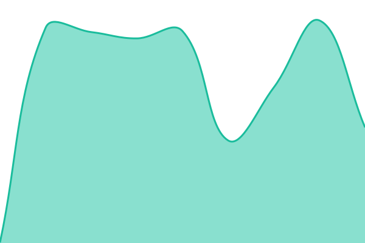
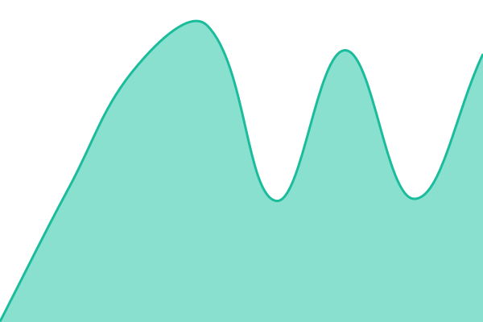
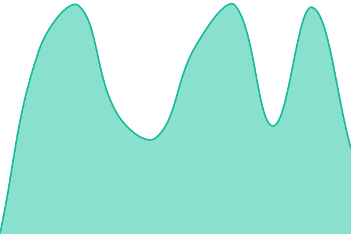

# [📈 Live Status](https://demo.upptime.js.org): <!--live status--> **🟧 Partial outage**

This repository contains the open-source uptime monitor and status page for [Upptime](https://upptime.js.org), powered by [Upptime](https://github.com/upptime/upptime).

With [Upptime](https://upptime.js.org), you can get your own unlimited and free uptime monitor and status page, powered entirely by a GitHub repository. We use [Issues](https://github.com/upptime/upptime/issues) as incident reports, [Actions](https://github.com/upptime/upptime/actions) as uptime monitors, and [Pages](https://demo.upptime.js.org) for the status page.

<!--start: status pages-->
<!-- This summary is generated by Upptime (https://github.com/upptime/upptime) -->
<!-- Do not edit this manually, your changes will be overwritten -->
<!-- prettier-ignore -->
| URL | Status | History | Response Time | Uptime |
| --- | ------ | ------- | ------------- | ------ |
|  [Testing](https://testing.occustarsecure.com) | 🟩 Up | [testing.yml](https://github.com/occustar/uptime.occustarsecure.com/commits/HEAD/history/testing.yml) | 

 543ms
     
 | 

<a href="https://demo.upptime.js.org/history/testing">100.00%</a>
    

|  [Scheduling](https://scheduling.occustarsecure.com) | 🟩 Up | [scheduling.yml](https://github.com/occustar/uptime.occustarsecure.com/commits/HEAD/history/scheduling.yml) | 

 738ms
     
 | 

<a href="https://demo.upptime.js.org/history/scheduling">100.00%</a>
    

|  [Beta](beta.occustarsecure.com) | 🟩 Up | [beta.yml](https://github.com/occustar/uptime.occustarsecure.com/commits/HEAD/history/beta.yml) | 

 654ms
     
 | 

<a href="https://demo.upptime.js.org/history/beta">100.00%</a>
    

|  [app stable](app.occustarsecure.com) | 🟥 Down | [app-stable.yml](https://github.com/occustar/uptime.occustarsecure.com/commits/HEAD/history/app-stable.yml) | 

 0ms
     
 | 

<a href="https://demo.upptime.js.org/history/app-stable">56.17%</a>
    

<!--end: status pages-->

[**Visit our status website →**](https://demo.upptime.js.org)

## 📄 License

- Powered by: [Upptime](https://github.com/upptime/upptime)
- Code: [MIT](./LICENSE) © [Anand Chowdhary](https://anandchowdhary.com)
- Data in the `./history` directory: [Open Database License](https://opendatacommons.org/licenses/odbl/1-0/)
